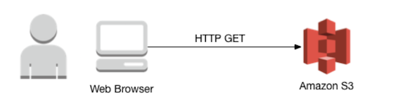
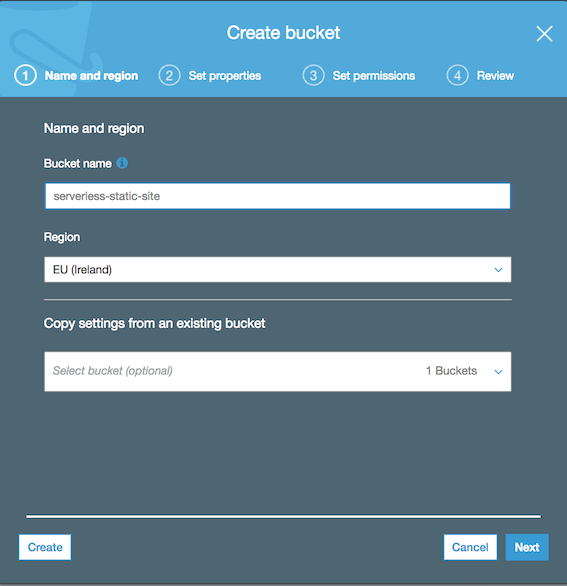
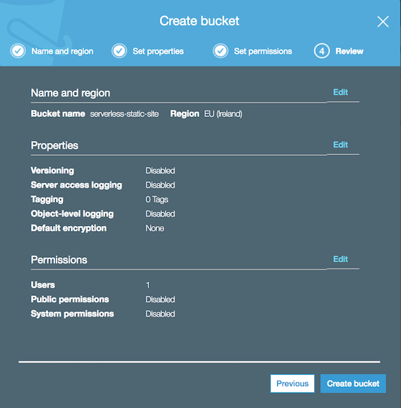
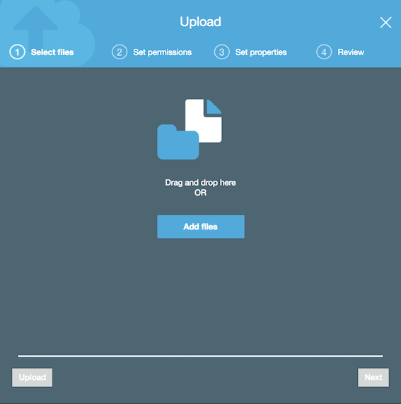
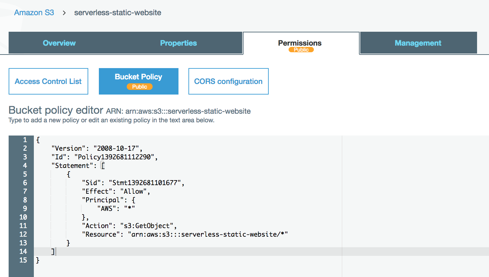
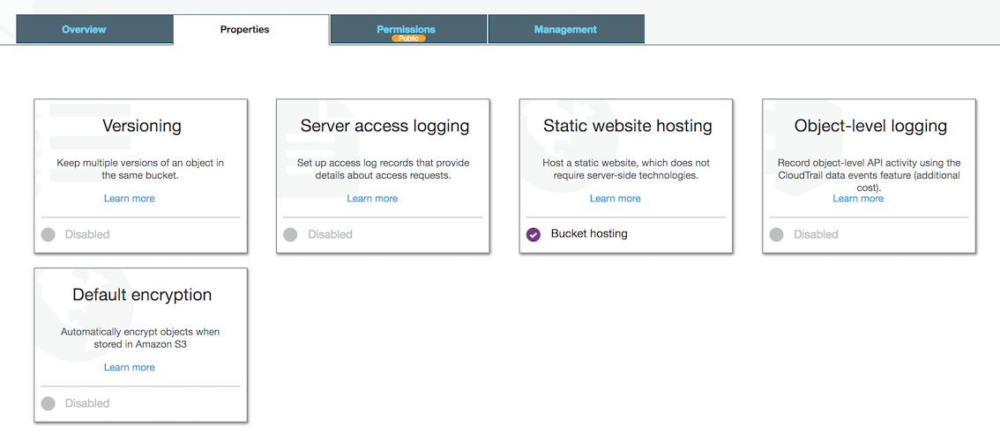

# Module 1: Web Hosting using Amazon S3

In this module we are going to deploy a static web, using Amazon Simple Storage Service (S3) as host.
The architecture is pretty simple: all your static web files (HTML, CSS, Javascript, images, etc.) will be stored in Amazon S3 and we will apply some policies to let users access to the web.



Firstly, we are going to solve the problem using the [Serverless](https://serverless.com/) framework. If you are already comfortable working with the AWS console and you don't want to use the framework "magic", you can go to the [Using the AWS console](#using-the-aws-console) section.

## Using Serverless Framework

As we pointed in the requirements section, it is necessary to have the Serverless framework installed in your machine to deploy the resources using it. Once we have the framework installed, we need to create a file called `serverless.yml`, where we will add all the resources and configuration. When we execute the serverless deploy command, it looks for a file with this name in the current directory and it deploys the defined resources there.

We will add the content below in this file:

```yaml
service: serverless-static-website

provider:
  name: aws
  runtime: nodejs6.10
  region: eu-west-1
  profile: default
  stage: dev

plugins:
  - serverless-finch

custom:
  client:
    bucketName: serverless-static-website
    distributionFolder: client/dist # (Optional) The location of your website. Default: client/dist
```

As you can see, we are going to use the [serverless-finch](https://github.com/fernando-mc/serverless-finch) plugin to deploy the static files to S3, so we need to install it. Just execute:

```
npm install --save serverless-finch
```

Once you have the plugin installed, we are going to execute the plugin deploy command:

```
serverless client deploy
```

You will find the URL of your newly deployed website in the command output. It will look like `http://<YOUR_BUCKET_NAME>.s3-website-<YOUR_REGION>.amazonaws.com/` and you should see the page shown in the [Validation](#validation) section.

## Using the AWS console

If you don't want to use the Serverless framework, you can get the same result using the AWS console. In order to do it, it is necessary to follow the steps below:

### Create a S3 bucket

1. In the AWS Management Console choose `Services` and select `S3`. It is located under the `Storage` section.

2. Click on the `+ Create bucket` button.

3. Choose a name for your bucket and select a region.



4. Click on `Next` button until you get the final step and then select `Create bucket`.




### Upload the content to S3

Once we have the bucket, we need to upload the static files. As we did the first step, we are going to do this using the AWS Management Console.

1. In the AWS Management Console choose `Services` and select `S3`.

2. Select the bucket that we created in the first section.

3. Click on the `Upload` button and select `Add files`.



4. Click on `Next` button until you get the final step and then select `Upload`.

### Add Bucket Policy to Allow Public Reads

To do this, it is necessary to follow the steps below:

1. In the AWS Management Console choose `Services` and select `S3`. Then, select the bucket that we created in the first section

2. Choose the `Permissions` tab. Then, select `Bucket Policy` section.

3. Enter the following policy into the bucket policy editor. Please, replace the `YOUR_BUCKET_NAME` part with the corresponding value.

```json
{
    "Version": "2008-10-17",
    "Id": "Policy1392681112290",
    "Statement": [
        {
            "Sid": "Stmt1392681101677",
            "Effect": "Allow",
            "Principal": {
                "AWS": "*"
            },
            "Action": "s3:GetObject",
            "Resource": "arn:aws:s3:::YOUR_BUCKET_NAME/*"
        }
    ]
}
```



4. Choose `Save` to apply the new policy.

### Enable Website Hosting

1. As we did in the previous steps, in the AWS Management Console choose `Services` and select `S3`. Then, select the bucket that we have created in the first section.

2. Choose the `Properties` tab and select `Static Website Hosting`. We will use `index.html` as index document.

3. Before saving the changes, note the URL at the top of the dialog (this will be the URL of the project). Then, click on the `Save` button.




Once we have finished these steps, we should see the page shown in the [Validation](#validation) section in our URL.

## Validation

You should see a page like the picture below in your website's base URL.


If you have completed this module you can move to the next one: [Serverless Backend: Save Users Info](../2-serverless-backend-save-users).
