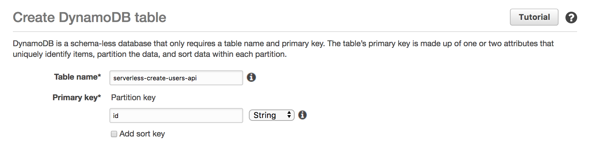
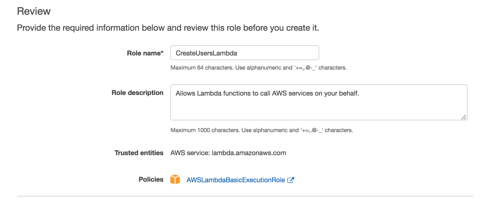
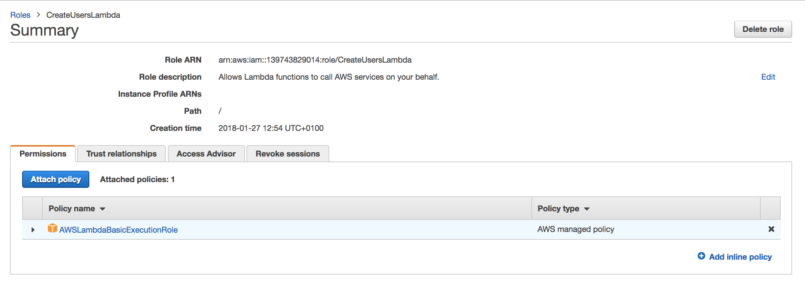
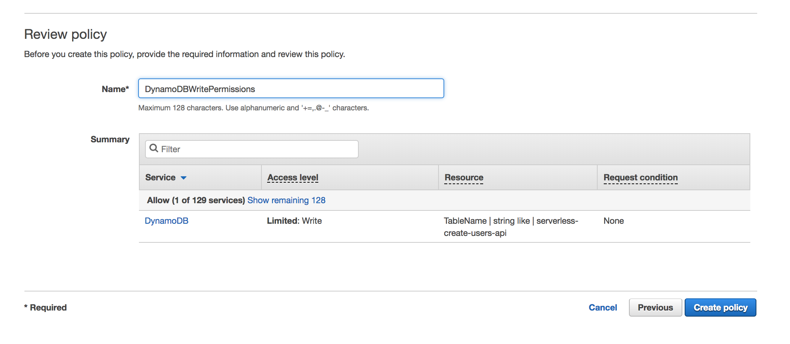
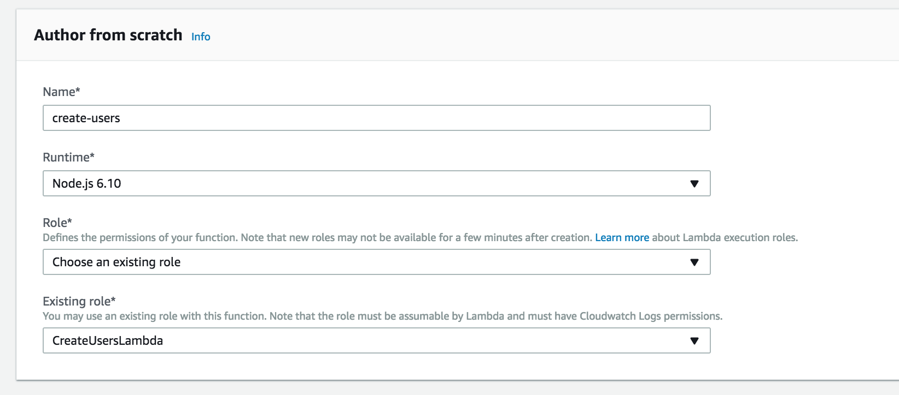
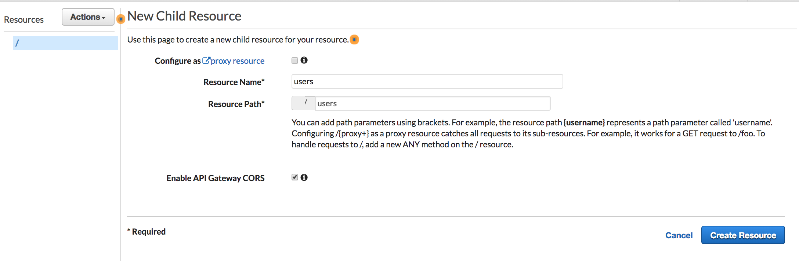
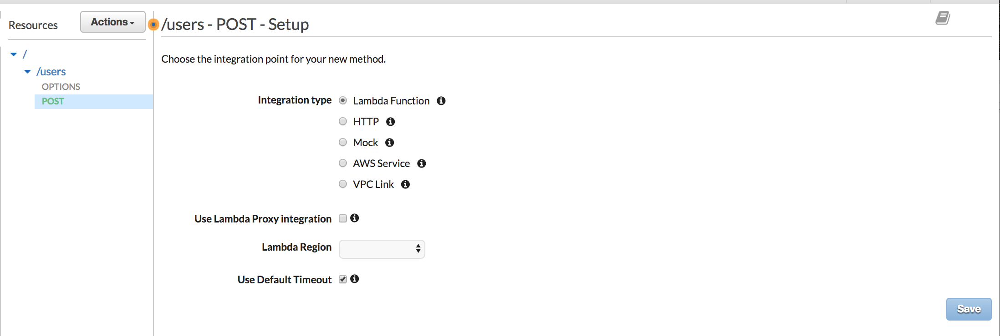
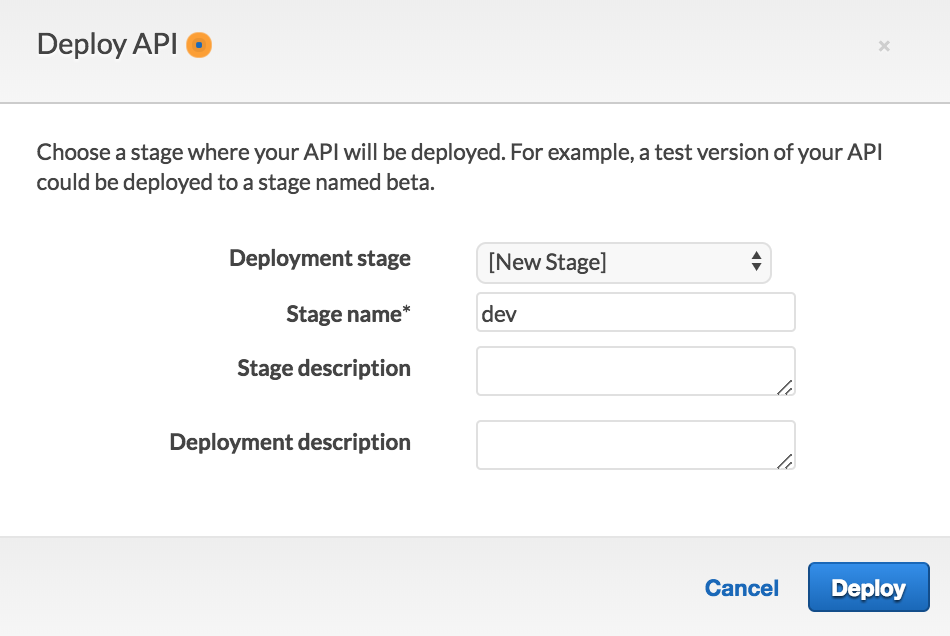
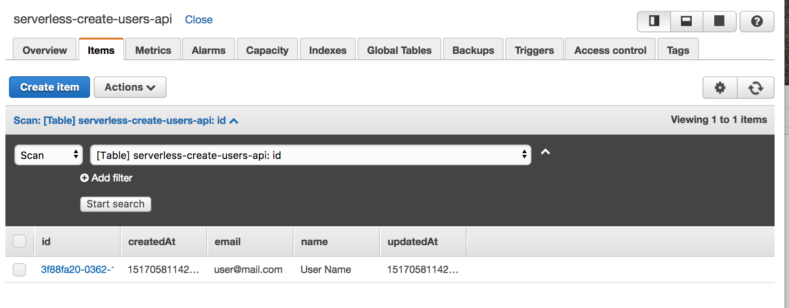
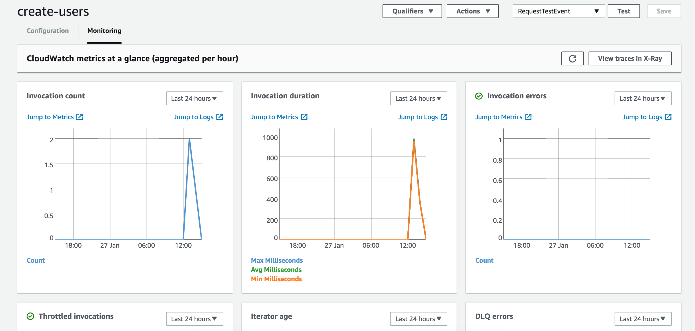

# Module 2: Serverless Service Backend: Save users

The webpage that we deployed in the first section had a form in order to users request more information about the product. In this module we are going to create a backend service to save all users who fill that form. Then, in the next module, we will create another function to send an email to those users.

The architecture of this module is like the figure below. We will create a function which will be called each time a user fills the contact form. The function will take the user information and save it in a DynamoDB table.


The function will be invoked using AWS API Gateway. We will connect our service to an API endpoint. As we already did in the last module, we are going to solve this module using two approaches:

* Using Serverless framework: Go to [Using Serverless Framework](#using-serverless-framework) section.

* Using the AWS Console: Go to [Using the AWS console](#using-the-aws-console) section.

## Using Serverless Framework

As we did in the first section, we need to create a `serverless.yml` file. In this file, we will place all the configuration that Serverless needs to deploy our application.

We are going to create a function triggered via an API which will save users in a database in this section, and we are going to use DynamoDB as database. So, in the serverless file we are going to say AWS to create an [IAM role](https://docs.aws.amazon.com/IAM/latest/UserGuide/id_roles.html) in order to put items in the database. We will also add the `DYNAMODB_TABLE` variable to the environment. See the `provider` part of the file below:

```yaml
service: serverless-create-users-api

provider:
  name: aws
  runtime: nodejs6.10
  region: eu-west-1
  profile: default
  stage: dev
  environment:
    DYNAMODB_TABLE: ${self:service}-${opt:stage, self:provider.stage}
  iamRoleStatements:
    - Effect: Allow
      Action:
        - dynamodb:PutItem
      Resource: "arn:aws:dynamodb:${opt:region, self:provider.region}:*:table/${self:provider.environment.DYNAMODB_TABLE}"
```

Next thing we are going to do is to define the function that will create the users. You can find the function in the `users` folder and the function name is `create`. We are also saying that the function will be triggered through a HTTP POST request.

```yaml
functions:
  create:
    handler: users/create.create
    events:
      - http:
          path: users
          method: post
          cors: true
```

Finally, we are going to create the DynamoDB table where the users will be saved. To do this, we define the DynamoDB Table type in the `resources` section of the `serverless.yml` file. As you can see, we are taking the name of the table from the environment (as we defined in the `provider` section) and we are also defining some parameters like the primary key of the table and the DynamoDB read/write capacity. More information about this [here](https://docs.aws.amazon.com/amazondynamodb/latest/developerguide/HowItWorks.ProvisionedThroughput.html).

```yaml
resources:
  Resources:
    UsersTable:
      Type: AWS::DynamoDB::Table
      DeletionPolicy: Retain # Keeps around the DynamoDB resource when we redeploy/destroy
      Properties:
        AttributeDefinitions:
          -
            AttributeName: id
            AttributeType: S
        KeySchema:
          -
            AttributeName: id
            KeyType: HASH
        ProvisionedThroughput:
          ReadCapacityUnits: 1
          WriteCapacityUnits: 1
        TableName: ${self:provider.environment.DYNAMODB_TABLE}

```

You can find the whole `serverless.yml` file in this folder.

Once you have the complete file, we are going to deploy. Execute:

```
serverless deploy
```

The command output will show the URL of the HTTP endpoint, it will be something like `https://0i5b3kodzl.execute-api.eu-west-1.amazonaws.com/dev/users`.

To check that the function works properly, go to [Validation](#validation):


## Using the AWS console

As we did in the first module, if you don't want to use the Serverless plugin, you can get the same result using the AWS console. In order to do it, it is necessary to follow the steps below:

### Create a DynamoDB Table

1. From the AWS Management Console, choose **Services** then select **DynamoDB**. It is located under the `Database` section.

2. Click on `Create Table` button

3. Enter `serverless-create-users-api` as database name. Then, enter `id` (type `String`) as primary key.



4. Click on `Create`. When the table is created, select the `Overview` section. Here, in the `Table details` part, save the `Amazon Resource Name (ARN)` value. We will use it later.

### Create an IAM Role for the Lambda function

In order to your Lambda function interact with other services, it is necessary to create an IAM Role associated with it. As we are going to write on a DynamoDB table in this module, we need to be able to interact with DynamoDB. We will also give permissions to interact with the [AWS CloudWatch](https://aws.amazon.com/es/cloudwatch/) service in order to see the function logs. See the steps below to do this:

1. From the AWS Management Console, choose **Services** and select **IAM**. It is located under the `Security, Identity & Compliance` section.

2. Here, select `Roles` in the left navigation part and click on `Create role` button.

3. In the AWS service section, select `Lambda`. Then, click on `Next: permissions` button.

4. Now, you need to choose what permissions you need for your function. Search `AWSLambdaBasicExecutionRole`. With this permission, the function will be able to write logs on `CloudWatch`. Click `Next: review` button.

5. Enter the Role name. For instance: `CreateUsersLambda`. Make sure that you have the same configuration than the picture below on the `Review` page and select `Create role`.



We said that we need permissions to write `CloudWatch` logs and to write on a `DynamoDB` table. Until now, we have only achieved the first part. Let's get the second one.

6. In the Roles page, select the role you just created (`CreateUsersLambda`). Then, on the `Permissions` part, select `Add inline policy`.



7. In the Service part, click on `Choose a service` and search for `DynamoDB`

8. In the Actions part, search for `PutItem` and select it.

9. In the Resources part, select the `Specific` option and paste the DynamoDB table ARN identificator that we saved in the last section.

10. Click on `Review Policy`. Here, select a name for your policy. For instance: `DynamoDBWritePermissions`.



11. Click on `Create Policy`.

### Create the Lambda function

In this part, we are going to create the Lambda function which will run our code to save the user in the DynamoDB table. To do this, follow the steps below:

1. From the AWS Management Console, choose **Services** and select **Lambda**. It is located under the `Compute` section. Here, click on `Create a function` button.

2. Under the `Author from scratch` section, fill the necessary fields. As name, we are going to select `create-users`.

3. Keeping `Nodejs 6.10` as runtime, select `Choose an existing role` in the **Role** part and choose the role that we created before in the `Existing role` part.



4. Click on `Create function`.

5. Now, we need to define the [trigger](https://docs.aws.amazon.com/lambda/latest/dg/invoking-lambda-function.html) for our function and enter the function code.

6. About the trigger, we are going to do it later, when we define an [API Gateway](https://aws.amazon.com/es/api-gateway/) endpoint for the function. In the code part, replace the default one with the content in the `create.js` file that you can see in the `users` folder within this section. Then, select `index.create` as **Handler**.

7. In the **Environment Variables** part, we need to define the DynamoDB Table name. Select `DYNAMODB_TABLE` as key and the name that you used for the table. In this case, we used `serverless-create-users-api`.

8. Click on the `Save` button in the right corner.

### Create the API

This is the last step to achieve our goal. Now, we are going to create an API using [API Gateway](https://aws.amazon.com/es/api-gateway/) in order to have an HTTP endpoint to call our Lambda function. This API will be accessible on the public internet, so we will be able to use it from the webpage that we created in the first section. To create it, follow the steps below:

1. From the AWS Management Console, choose **Services** and select **API Gateway**. It is located under `Networking & Content Delivery`. Select `Get Started`.

2. Select `New API` and enter `create-users` as API name. Then, click on `Create API` button.

3. The next step is to create a new resource. In the left part, select `Resources`. Then, in the `Actions` dropdown, select `Create Resource`.

4. Enter `users` as resource name, and it will put `/users` as resource path.

5. Select `Enable API Gateway CORS` option and click on `Create Resource` button.



6. Click on the just created resource (`users`). In the `Actions` dropdown button, select `Create Method` and select `POST`.



7. Select `Lambda Function` as **Integration Type**. Then select **Use Lambda Proxy Integration** option and then you will need to choose your section and your lambda function name. In this workshop, we have used `eu-west-1` as region and `create-users` as name. Click on `Save`.

8. The last step is to deploy the API. In the `Actions` dropdown, select `Deploy API`. Select `[New Stage]` in the **Deployment Stage** part and enter `dev` as **Stage Name**. Then, click on `Deploy` button.



9. You will get an **Invoke URL**. Save it to call your function.

## Validation

We are going to check that the function works properly. Firstly, we are going to execute an HTTP request to create a new user. In the URL, you need to put your API URL.

```
curl -X POST 'https://0i5b3kodzl.execute-api.eu-west-1.amazonaws.com/dev/users' --data '{"name": "User Name", "email": "user@mail.com"}'
```

It should return something like:

```
{"id":"f6335370-0361-11e8-a840-8dd584b65bc8","name":"User Name","email":"user@mail.com","createdAt":1517057991207,"updatedAt":1517057991207}
```

If we go to the DynamoDB table, we can check that the new user was properly added. To do this, go to **DynamoDB** service in the AWS Management console. Then, select the created table and select `Items` in the navigation bar.



We also can check that our function was called one time and it finished without any errors, as well as the operation time duration. To do this, go to the `Lambda` service from the AWS Management console. Here, select your function in the **Functions** part. In the `Monitoring` section, you will see graphics with all this data.



If you have completed this module you can move to the next one: [Serverless Backend: Send Emails](../3-serverless-backend-send-emails).
