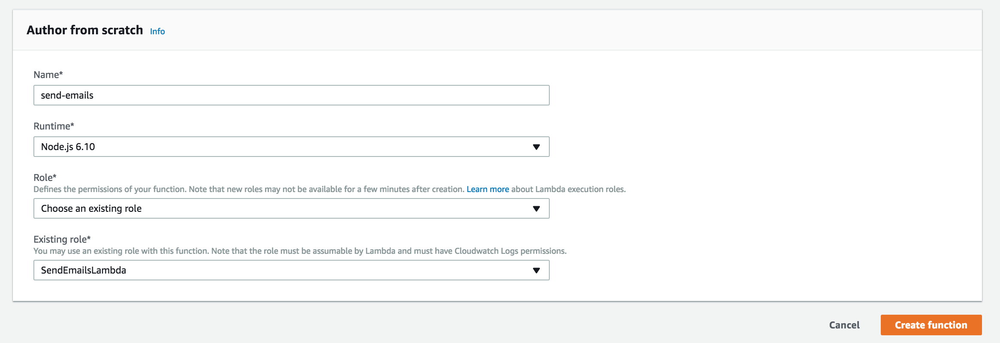
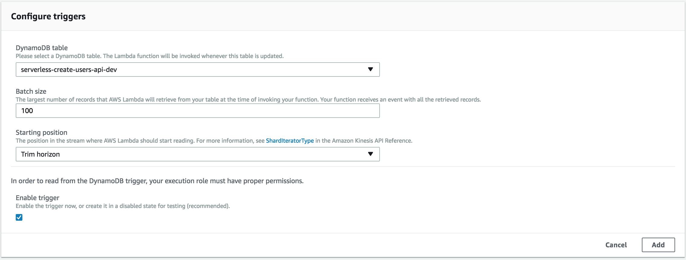
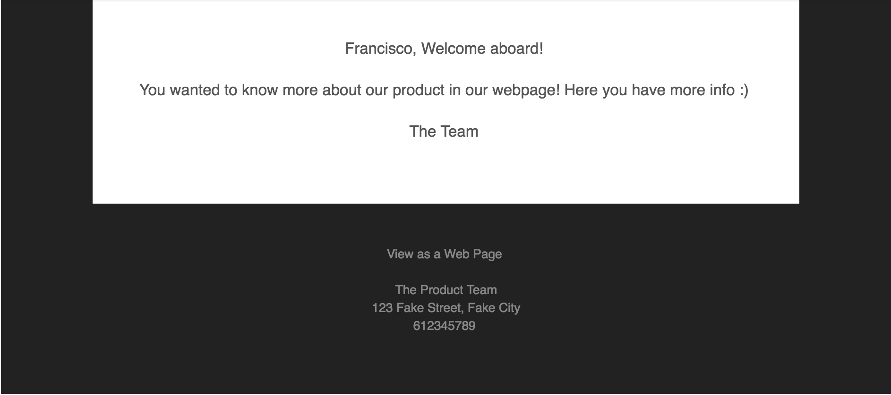

# Module 3: Serverless Service Backend: Send emails

In the first module, we have created a simple webpage with an email form to get users data. In the second one, we have created a Lambda function which, triggered via an HTTP request, save an user information in a DynamoDB table. In this module, we are going to create the final part of this application. We are going to add a Lambda function which, every time a new entry is added in the DynamoDB table, will send an email to the specific user.

The architecture of this module is like the figure below. We will create a function which will be called each time a new entry is added in the DynamoDB table. The function will take the user information and send an email to the proper email address.


So we have a new trigger for the Lambda function in this module. In the module 2 we used an API Gateway endpoint as trigger for the function. In this module, as we have said, we are going to use DynamoDB. Then, in order to send emails, we will use [AWS Simple Email Service](https://aws.amazon.com/es/ses/). As we are doing in all the modules, we are going to solve this problem using two approaches:

* Using Serverless framework: Go to [Using Serverless Framework](#using-serverless-framework) section.

* Using the AWS Console: Go to [Using the AWS console](#using-the-aws-console) section.

Before going to our favourite approach, we need to make a common step. We are going to use [AWS Simple Email Service](https://aws.amazon.com/es/ses/) to send emails, so we need to validate our email in order to be able to send them. You can do it following the steps described in this [link](https://docs.aws.amazon.com/ses/latest/DeveloperGuide/verify-email-addresses-procedure.html) from the AWS documentation.

## Using Serverless Framework

First thing we need to do is to create a `serverless.yml` file (as we did in the last modules). In this file, we will place all the configuration that Serverless needs to deploy our application.

We are going to create a function triggered via DynamoDB which will send emails to the proper user. Every time we add a new item to the DynamoDB table, the function will be executed.

So, in the serverless file we are going to say AWS to create an [IAM role](https://docs.aws.amazon.com/IAM/latest/UserGuide/id_roles.html) in order to be able to get item information from the database. We are going to use the same database that we created in the step 2, so we need to get the stream ARN from there and place it in the `serverless.yml` file. In order to do it, go to [Create a DynamoDB Table](../2-serverless-backend-save-users/###create-a-dynamodb-table) section from the module 2. There, it is described how to get the resource ARN. As we said in the Module 2, you can get more info about DynamoDB streams [here](https://docs.aws.amazon.com/amazondynamodb/latest/developerguide/Streams.html). We also need to send emails, so we need to add the proper permissions.

```yaml
service: serverless-create-users-api

provider:
  name: aws
  runtime: nodejs6.10
  region: eu-west-1
  profile: default
  stage: dev
  environment:
    DYNAMODB_TABLE: ${self:service}-${opt:stage, self:provider.stage}
  iamRoleStatements:
    - Effect: Allow
      Action:
        - dynamodb:GetRecords
        - dynamodb:GetShardIterator
        - dynamodb:DescribeStream
        - dynamodb:ListStreams
      Resource: <YOUR_STREAM_ARN>
    - Effect: Allow
      Action:
        - "ses:*"
      Resource: "*"
```

Next step we are going to do is to define the function which will send the emails. As we already said, this function will be triggered each time a new item is added in the DynamoDB table and we measure the table activity with the DynamoDB stream. You can find the function in the `emails` folder and the function name is `send`. Please, remember to change the `<YOUR_STREAM_ARN>` part with your specific one.

```yaml
functions:
  sendEmail:
    handler: emails/send.send
    events:
      - stream: <YOUR_STREAM_ARN>
```

You can find the whole `serverless.yml` file in this folder.

Once you have the complete file, we are going to deploy. Execute:

```
serverless deploy
```

To check that the function works properly, go to [Validation](#validation):

## Using the AWS Console

As we did in the rest of the modules, if you don't want to use the Serverless framework, you can get the same result using the AWS console. In order to do it, it is necessary to follow the steps below:


### Create an IAM Role for the Lambda function

In order to your Lambda function interact with other services, it is necessary to create an IAM Role associated with it. As we are going to get information from a DynamoDB stream in this module, we need to be able to interact with it. We will also give permissions to interact with the [AWS CloudWatch](https://aws.amazon.com/es/cloudwatch/) service in order to see the function logs. See the steps below to do this:

1. From the AWS Management Console, choose **Services** and select **IAM**. It is located under the `Security, Identity & Compliance` section.

2. Here, select `Roles` in the left navigation part and click on `Create role` button.

3. In the AWS service section, select `Lambda`. Then, click on `Next: permissions` button.

4. Now, you need to choose what permissions you need for your function. Search `AWSLambdaBasicExecutionRole`. With this permission, the function will be able to write logs on `CloudWatch`. Click `Next: review` button.

5. Enter the Role name. For instance: `SendEmailsLambda`. Until now, this is the same that we already did in the Module 2 so you can get screenshots from there to get more information.

We said that we need permissions to write `CloudWatch` logs and to get information from a `DynamoDB` stream. Until now, we have achieved the first part. Let's get the second one.

6. In the Roles page, select the role you just created (`CreateUsersLambda`). Then, on the `Permissions` part, select `Add inline policy`.

7. In the Service part, click on `Choose a service` and search for `DynamoDB`

8. In the Actions part, search for:

* DescribeStream
* GetRecords
* GetShardIterator
* ListStreams

Select all of them.

9. In the Resources part, select the `Specific` option and paste the DynamoDB stream ARN identificator that we saved in the last section.

10. Click on `Review Policy`. Here, select a name for your policy. For instance: `DynamoDBStreamGetInfo`.

11. Click on `Create Policy`.

### Create the Lambda function

In this part, we are going to create the Lambda function which will run our code to send the email to the user. To do this, follow the steps below:

1. From the AWS Management Console, choose **Services** and select **Lambda**. It is located under the `Compute` section. Here, click on `Create a function` button.

2. Under the `Author from scratch` section, fill the necessary fields. As name, we are going to select `send-emails`.

3. Keeping `Nodejs 6.10` as runtime, select `Choose an existing role` in the **Role** part and choose the role that we created before in the `Existing role` part.



4. Click on `Create function`.

Now, we need to define the [trigger](https://docs.aws.amazon.com/lambda/latest/dg/invoking-lambda-function.html) for our function and enter the function code.

5. About the trigger, we are going select DynamoDB, as we are going to send emails when a new item is added to our table. As DynamoDB table, select the table that we created in the module 2. For the rest of the fields (Batch size and Starting position), just leave the default settings. About the Starting position field, you can get more information [here](https://docs.aws.amazon.com/kinesis/latest/APIReference/API_GetShardIterator.html#Streams-GetShardIterator-request-ShardIteratorType).



6. Click on the `Add` button.

7. In the code part, replace the default one with the content in the `send.js` file that you can see in the `emails` folder within this section. Then, select `index.send` as **Handler**.

8. Click on the `Save` button in the right corner.

## Validation

NOTE: In order to validate this module, we also need the module 2 already running, as we need its database. Follow the steps below to validate both parts:

- Get the API URL from the module 2 and create a user, replacing that URL from your specific one and using a valid email.

```
curl -X POST 'https://0i5b3kodzl.execute-api.eu-west-1.amazonaws.com/dev/users' --data '{"name": "User Name", "email": "user@mail.com"}'
```

Using this API, it should create an user in the DynamoDB table. As soon as the table gets a new item, the activity will be notified in the stream, where our function in the module 3 is listening. So, once we call to the API in the module 2, we should receive an email like the one below in our email address.



If you have completed this module you can move to the last one: [Call Backend from Website](../4-call-backend-from-website).
