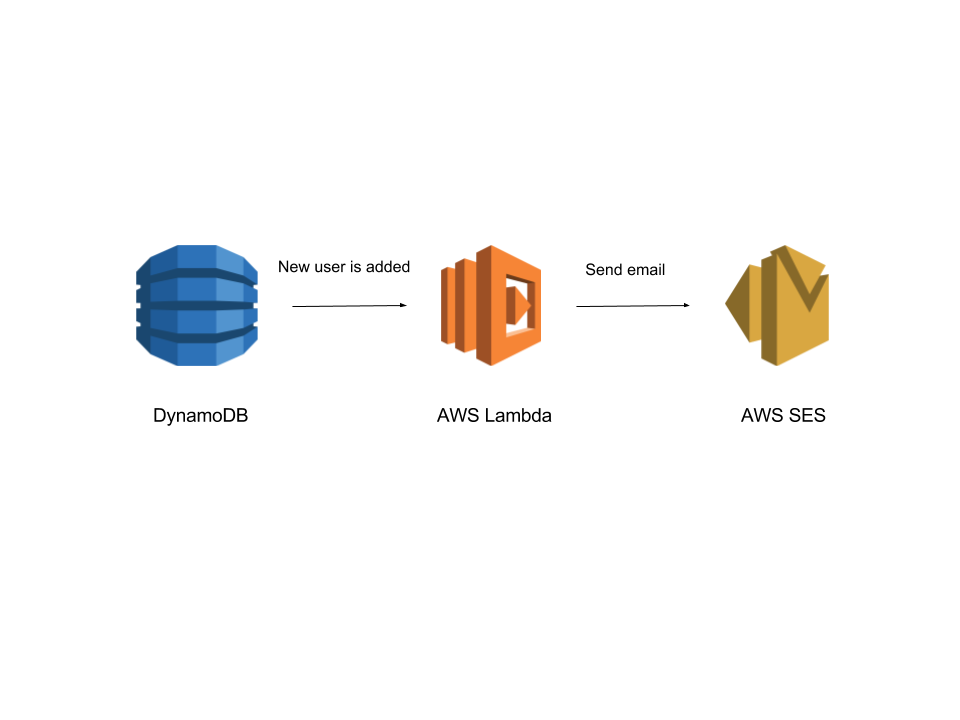

# Module 3: Serverless Service Backend: Send emails

In the first module, we have created a simple webpage with an email form to get users data. In the second one, we have created a Lambda function which, triggered via an HTTP request, save an user information in a DynamoDB table. In this module, we are going to create the final part of this application. We are going to add a Lambda function which, every time a new entry is added in the DynamoDB table, will send an email to the specific user.

The architecture of this module is like the figure below. We will create a function which will be called each time a new entry is added in the DynamoDB table. The function will take the user information and send an email to the proper email address.



So we have a new trigger for the Lambda function in this module. In the module 2 we used an API Gateway endpoint as trigger for the function. In this module, as we have said, we are going to use DynamoDB. Then, in order to send emails, we will use [AWS Simple Email Service](https://aws.amazon.com/es/ses/). As we are doing in all the modules, we are going to solve this problem using two approaches:

* Using Serverless framework: Go to [Using Serverless Framework](#using-serverless-framework) section.

* Using the AWS Console: Go to [Using the AWS console](#using-the-aws-console) section.

## Using Serverless Framework

First thing we need to do is to create a `serverless.yml` file (as we did in the last modules). In this file, we will place all the configuration that Serverless needs to deploy our application.

We are going to create a function triggered via DynamoDB which will send emails to the proper user. Every time we add a new item to the DynamoDB table, the function will be executed.

So, in the serverless file we are going to say AWS to create an [IAM role](https://docs.aws.amazon.com/IAM/latest/UserGuide/id_roles.html) in order to be able to get item information from the database. We are going to use the same database that we created in the step 2, so we need to get the stream ARN from it. In order to do it, go to [#PUT A SECTION HERE](). As we said in the Module 2, you can get more info about DynamoDB streams [here](https://docs.aws.amazon.com/amazondynamodb/latest/developerguide/Streams.html). We also need to send emails, so we need to add the proper permissions.

```yaml
service: serverless-create-users-api

provider:
  name: aws
  runtime: nodejs6.10
  region: eu-west-1
  profile: default
  stage: dev
  environment:
    DYNAMODB_TABLE: ${self:service}-${opt:stage, self:provider.stage}
  iamRoleStatements:
    - Effect: Allow
      Action:
        - dynamodb:GetRecords
        - dynamodb:GetShardIterator
        - dynamodb:DescribeStream
        - dynamodb:ListStreams
      Resource: <YOUR_STREAM_ARN>
    - Effect: Allow
      Action:
        - "ses:*"
      Resource: "*"
```

Next step we are going to do is to define the function which will send the emails. As we already said, this function will be triggered each time a new item is added in the DynamoDB table and we measure the table activity with the DynamoDB stream. You can find the function in the `emails` folder and the function name is `send`. Please, remember to change the `<YOUR_STREAM_ARN>` part with your specific one.

```yaml
functions:
  sendEmail:
    handler: emails/send.send
    events:
      - stream: <YOUR_STREAM_ARN>
```

You can find the whole `serverless.yml` file in this folder.

Once you have the complete file, we are going to deploy. Execute:

```
serverless deploy
```

To check that the function works properly, go to [Validation](#validation):

## Using the AWS Console

## Validation

NOTE: In order to validate this module, we also need the module 2 already running, as we need its database. Follow the steps below to validate both parts:

- Get the API URL from the module 2 and create a user, replacing that URL from your specific one and using a valid email.

```
curl -X POST 'https://0i5b3kodzl.execute-api.eu-west-1.amazonaws.com/dev/users' --data '{"name": "User Name", "email": "user@mail.com"}'
```

Using this API, it should create an user in the DynamoDB table. As soon as the table gets a new item, the activity will be notified in the stream, where our function in the module 3 is listening. So, once we call to the API in the module 2, we should receive an email in our email address.
