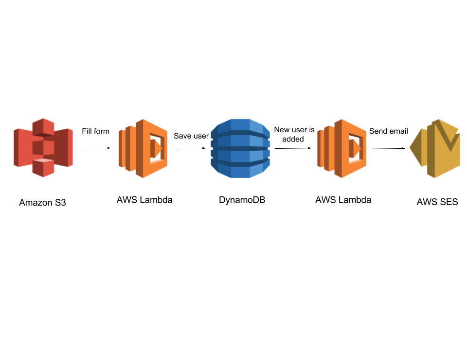

# Module 4: Call Backend From Website

Until now, we have completed three modules:

* In the first one, we have created a simple webpage with an email form to get users data.

* In the second module, we have created a Lambda function which, triggered via an HTTP request, save an user information in a DynamoDB table.

* The third module was about creating a Lambda function which, every time a new entry is added in the DynamoDB table that we created in the second one, will send an email to the specific user.

Now, we are going to create the final part of the application. We are going to update the static files in the first module in order to call the API we created in the second one from the email form. So, once an user fills the form, he/she will receive an email.

The architecture of this module is like the figure below and you need to have the previous ones deployed to be able to validate it.



To solve this problem, we keep the approaches we have used during all this workshop:

* Using Serverless framework: Go to [Using Serverless Framework](#using-serverless-framework) section.

* Using the AWS Console: Go to [Using the AWS console](#using-the-aws-console) section.

## Using Serverless Framework

We don't need to create another `serverless.yml` file in this section. The only thing we need is to change the code in the static files that we have in the first module in order to call our API. Concretely, it is necessary to change the `contact-form-script.js` file, located under the `client/dist/js` directory. Replace the original HTTP POST request (it starts at line 22) for this one:

```js
$.ajax({
    type: "POST",
    url: "https://x7emf5bl5c.execute-api.eu-west-1.amazonaws.com/dev/users",
    data: {
        "name": name,
        "email": email
    },
    dataType: "json",
    beforeSend: function(x) {
        if (x && x.overrideMimeType) {
          x.overrideMimeType("application/j-son;charset=UTF-8");
        }
    },
    success : function(text){
        if (text == "success") {
            console.log(text)
            formSuccess();
        } else {
            formError();
            submitMSG(false,text);
        }
    }
});
```

Once you have edited the file, we are going to deploy the web again. Go to the first module directory and execute:

```
serverless client deploy
```

To check that the function works properly, go to [Validation](#validation):

## Using the AWS Console

Now, we are going to do the same from the AWS Console.

1. Go to the S3 bucket we created in the first module.

2. Search the `contact-form-script.js` file, located under the `client/dist/js` directory.

3. Replace the original HTTP POST request (it starts at line 22) for this one:

```js
$.ajax({
    type: "POST",
    url: "https://x7emf5bl5c.execute-api.eu-west-1.amazonaws.com/dev/users",
    data: {
        "name": name,
        "email": email
    },
    dataType: "json",
    beforeSend: function(x) {
        if (x && x.overrideMimeType) {
          x.overrideMimeType("application/j-son;charset=UTF-8");
        }
    },
    success : function(text){
        if (text == "success") {
            console.log(text)
            formSuccess();
        } else {
            formError();
            submitMSG(false,text);
        }
    }
});
```

To check that the application works properly, go to [Validation](#validation):

## Validation

To check that our platform works properly, we only have to fill the email contact form and submit it. After this, we should receive an email in the email address that we chose.
