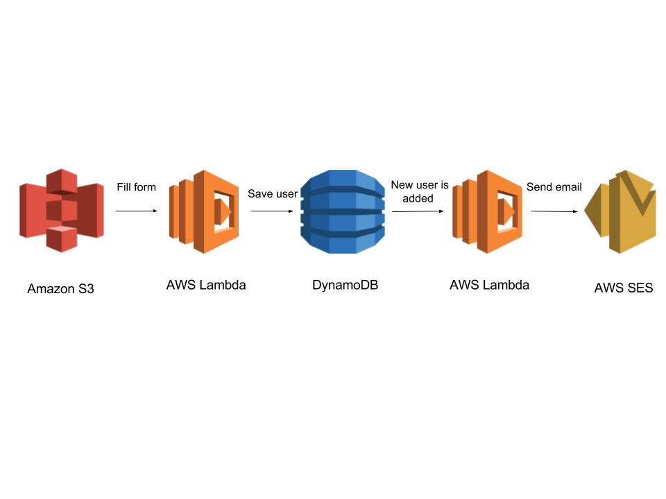

# Serverless Web Application Workshop

In this workshop you will deploy a simple Demo Landing webpage for your favourite product. The application will show the features of your product, a sample video of those features and a email form contact for people who want to know more about the product. When users fill the email form, it will call to a backend service in order to save the user information. Then, it will send an email to the user with more product details. So, the application architecture is like the picture below:



The idea behind the workshop is to show how simple is to get a solution like this one to validate an idea. Apart from this simplicity, the use of Serverless in the AWS environment will automatically provide us things like:

* **Metrics**: it is very important to recollect information about the usage of our platform as soon as possible. Using AWS Lambda, we will have the usage control of our functions since the first moment.

* **Cost**: we are not going to spend money if nobody uses the platform.

The application architecture uses [AWS Lambda](https://aws.amazon.com/es/lambda/), [Amazon API Gateway](https://aws.amazon.com/es/api-gateway/), [Amazon S3](https://aws.amazon.com/es/s3/), [Amazon DynamoDB](https://aws.amazon.com/es/dynamodb/) and [Amazon Simple Email Service](https://aws.amazon.com/es/ses/).

To deploy the application, you can take two different approaches:

* Use the [Serverless](https://serverless.com/) framework: it provides an abstraction over AWS and makes your infrastructure as code.

* Use the [AWS console](https://console.aws.amazon.com).

You can find the documentation for both options in each module.

## Modules

The workshop is broken up into different modules, one for each part of the result application. The idea is to do it in the order below:

1. [Web Hosting](1-web-hosting)
2. [Serverless Backend. Save Users Info](2-serverless-backend-save-users)
3. [Serverless Backend. Send Emails](3-serverless-backend-send-emails)
4. [Call Backend From Website](4-call-backend-from-website)

Once you have finished, you should delete the created resources to avoid billing charges.

## Requirements

### AWS Account

It is necessary to have an AWS Account with access to the services above. All the resources you will launch in this workshop are available in the [AWS Free Tier](https://aws.amazon.com/es/free/). Once you have the account, it is necessary to setup an account so that the Serverless framework can interact with AWS. You can do it following [this documentation](https://serverless.com/framework/docs/providers/aws/guide/credentials/) and there is also a [video](https://www.youtube.com/watch?v=HSd9uYj2LJA) which explains the process.

### Serverless Framework

If you want to do the workshop using the Serverless framework approach, you need to have the Serverless framework installed on your machine. To install it, you need `npm` and execute:

```
npm install -g serverless
```

More information in the [Serverless documentation](https://serverless.com/framework/docs/getting-started/).
